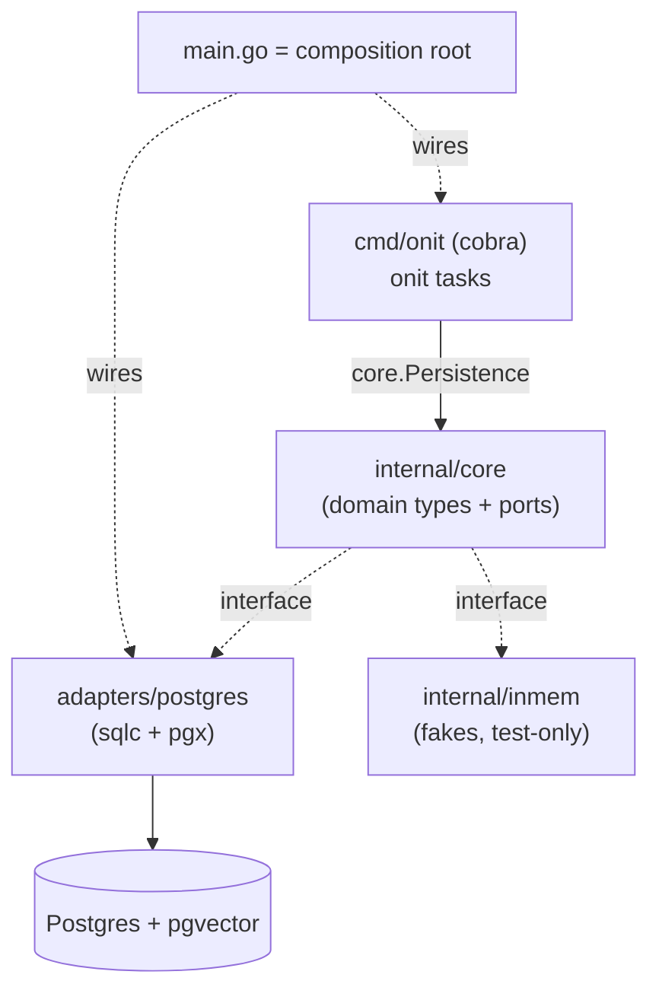

# Foundation (hexagonal wiring) — Design

**Spec**: `.specs/features/foundation/spec.md`
**Status**: Draft
**Informed by**: `docs/decisions.md` (ADR-001…008), `docs/bounded-contexts.md`, `docs/prd.md` §7–§10, §15

---

## Architecture Overview

Hexagonal wiring with **zero agent logic**. The only executable path is `onit tasks`:
the CLI host reads tasks through the persistence port, backed by the real Postgres adapter.
The core depends only on interfaces (ports); in-memory fakes let the whole core run under
`go test` with no network. The composition root (`cmd/onit/main.go`) is the only place that
imports both the core and the adapters.



**Invariant (FND-05):** arrows from the core to adapters are *interfaces only*. The core's
non-test code imports nothing under `internal/adapters/…`. The postgres adapter and the inmem
fakes both import the core (dependency points inward).

---

## Package layout (this slice)

Subset of the full tree in `docs/bounded-contexts.md`. Foundation creates only what `onit tasks`
and the data model require; `agent/` is deferred to the Understand slice.

```
/cmd/onit/
  main.go            # composition root: build postgres adapter, wire cobra, resolve current user
  tasks.go           # `onit tasks` command (thin: calls port, renders)
/internal/core/
  ports.go           # 🟨 cross-cutting ports (ADR-008): Persistence, LLM, Clock
  ids.go             # typed IDs: UserID, TaskID, NegotiationID, ProviderID, MessageID
  identity/          # User
  understanding/     # Task (typed spine + attributes), TaskState
  negotiation/       # Negotiation (FSM named type), Message, NegotiationState
  discovery/         # Provider (+ provenance), DiscoverySource, discovery.Port (registry)
  scheduling/        # scheduling.CalendarPort   (declared + fake only this slice)
  memory/            # memory.Port               (declared + fake only this slice)
/internal/inmem/     # in-memory fakes for every port (used by core tests, never by core build)
/internal/adapters/postgres/
  adapter.go         # implements core.Persistence over pgx pool
  queries/*.sql      # sqlc source (e.g. ListTasksByUser)
  gen/               # sqlc-generated code (lives ONLY here)
/db/migrations/      # goose up/down .sql for the 5 tables
sqlc.yaml  docker-compose.yml  Makefile  go.mod
```

---

## Code Reuse Analysis

Greenfield — nothing to import yet. "Reuse" here means following locked decisions and skills.

| Source | How to use |
| --- | --- |
| `docs/decisions.md` ADR-001…008 | Cobra, pgx+sqlc, goose, layout, port location — all already decided |
| `docs/bounded-contexts.md` | Package boundaries + reference-by-ID rule |
| `golang-spf13-cobra`, `golang-cli` skills | Command structure, exit codes, `SetArgs`/`SetOut` testability |
| `golang-database` skill | pgx pool, struct scanning, `user_id` filtering, context propagation |
| `golang-project-layout` skill | `cmd/`/`internal/` conventions |
| `golang-structs-interfaces`, `golang-error-handling` skills | Consumer-defined interfaces; `%w` wrapping, sentinel errors |

### Integration Points

| System | Integration method |
| --- | --- |
| Postgres | `pgxpool` in `adapters/postgres`; schema via goose; queries via sqlc; always filtered by `user_id` |
| Current user | Resolved from config in `main.go` (Decision B) — no `User` bootstrap this slice |

---

## Components

### `internal/core` (root) — cross-cutting ports & IDs
- **Purpose**: hold the ports used by several contexts (ADR-008) and the typed IDs.
- **Interfaces**:
  - `Persistence` — `ListTasks(ctx, UserID) ([]understanding.Task, error)` *(grows per slice)*
  - `LLM` — `Complete(ctx, Request) (Response, error)` *(declared + fake; not exercised)*
  - `Clock` — `Now() time.Time` *(declared; isolates the core from the wall clock, PRD §9.1)*
- **Dependencies**: context packages (for return types). **Reuses**: —

### `internal/core/understanding` — Task
- **Purpose**: the `Task` aggregate (typed spine + open attributes).
- **Interfaces**: `ParseTaskState(string) (TaskState, error)` (errors on unknown).
- **Dependencies**: `identity` (UserID). **Reuses**: `golang-structs-interfaces`.

### `internal/core/negotiation` — Negotiation FSM + Message
- **Purpose**: `Negotiation` as a named-type state machine + `Message`.
- **Interfaces**: `ParseNegotiationState(string) (NegotiationState, error)` (errors on unknown).
- **Dependencies**: `identity`, references `TaskID`/`ProviderID` by value. **Reuses**: PRD §10.2 states.

### `internal/core/discovery` — Provider + registry port
- **Purpose**: `Provider` (with provenance), `DiscoverySource`, registry `Port`.
- **Interfaces**: `Port.Find(ctx, Query) ([]Provider, error)` *(declared + fake)*.
- **Dependencies**: `identity`. **Reuses**: PRD §15.2.

### `internal/adapters/postgres` — Persistence adapter
- **Purpose**: implement `core.Persistence` over pgx; map sqlc rows → core domain types (ACL at the persistence edge — the sqlc struct is **not** the domain `Task`).
- **Interfaces**: `New(pool) *Adapter`; `ListTasks(ctx, UserID) ([]understanding.Task, error)`.
- **Dependencies**: pgx, sqlc-gen, core. **Reuses**: `golang-database`.

### `cmd/onit` — CLI host
- **Purpose**: thin host; `onit tasks` renders the list (or empty state).
- **Interfaces**: cobra `tasksCmd`; `main()` composition root.
- **Dependencies**: core (ports), adapters/postgres. **Reuses**: `golang-spf13-cobra`.

### `internal/inmem` — fakes
- **Purpose**: in-memory implementations of every port for core tests.
- **Dependencies**: core. **Reuses**: —. **Note**: separate from `adapters/` so the FND-05 boundary test stays trivial (core imports neither `adapters/…` nor `inmem` in build code).

---

## Data Models

> Sketches at design altitude (Go-ish). Spine is typed (named types/enums); `attributes` is the
> open boundary (PRD §15.3). Every transactional row carries `UserID` (PRD §7–§8).

```go
// identity
type UserID string
type User struct { ID UserID /* M0: minimal; prefs/credentials added in later slices */ }

// understanding
type TaskState string // ParseTaskState errors on unknown; stored as text
const ( TaskCreated TaskState = "created"; TaskUnderstood = "understood"
        TaskActing = "acting"; TaskAwaitingApproval = "awaiting_approval"
        TaskConfirmed = "confirmed"; TaskCancelled = "cancelled" ) // PROVISIONAL — see open item #2
type Task struct {
    ID          TaskID
    UserID      UserID
    ServiceType string
    Location    string
    TimeWindow  string       // refined to a value object in the Understand slice
    BudgetCap   *int64       // cents; nil = unset
    Constraints string
    State       TaskState
    Attributes  map[string]any // jsonb open boundary; nil/absent → empty
}

// negotiation  (FSM per PRD §10.2)
type NegotiationState string
const ( NegDraft = "draft"; NegAwaitingResponse = "awaiting_response"
        NegCounteroffer = "counteroffer"; NegHumanApproval = "human_approval"
        NegConfirmed = "confirmed"; NegDeclined = "declined"; NegExpired = "expired" )
type Negotiation struct { ID NegotiationID; UserID UserID; TaskID TaskID; ProviderID ProviderID; State NegotiationState }
type Message struct { ID MessageID; UserID UserID; NegotiationID NegotiationID; /* direction, body, ts */ }

// discovery  (provenance per PRD §15.2)
type Provider struct {
    ID ProviderID; UserID UserID; Name, Phone string; Rating float64; Hours string
    Source string; Confidence float64; Evidence string
}
```

**Schema (goose):** five tables (`users`, `tasks`, `negotiations`, `providers`, `messages`), each
with `user_id`; `tasks.attributes jsonb`; state columns as `text` (parsed/validated in Go, not via
DB enums — invalid value from DB → explicit error, FND-07).

---

## Error Handling Strategy

| Scenario | Handling | User impact |
| --- | --- | --- |
| DB unavailable (FND-03) | adapter returns wrapped error; `main` maps to message + `os.Exit(!=0)` | clear message, no stacktrace |
| Unknown state from DB (FND-07) | `Parse*State` returns error; scan fails loudly | explicit error, never a silent default |
| `attributes` null/absent | decode to empty `map` | normal empty result |
| No current user configured | `main` warns clearly, exits cleanly | guidance message, no panic |
| Empty task list | valid result | "no tasks yet" |

Conventions: wrap with `%w`, sentinel errors for the cases the host inspects (`golang-error-handling`);
structured logging via `slog`.

---

## Tech Decisions (non-obvious)

| Decision | Choice | Rationale |
| --- | --- | --- |
| Cross-cutting port location | root `internal/core` | ADR-008 (avoids import cycles) |
| Persistence shape | **single** `core.Persistence`, starts with `ListTasks` | matches PRD's `PortPersistence`; YAGNI — split into per-aggregate repos only if it grows painful |
| Fakes location | `internal/inmem` (not under `adapters/`) | keeps FND-05 import-boundary test trivial; separates test doubles from real I/O |
| sqlc-generated types | live **only** in `adapters/postgres`; adapter maps to core types | core stays free of generated code; ACL at the persistence edge |
| State enums | named `string` types + `Parse` that errors on unknown; stored as `text` | "invalid states hard to represent" (PRD §7) + FND-07 |
| Composition root | `cmd/onit/main.go` | only place importing core + adapters |

---

## Open items to ratify before Tasks

1. ✅ **Go module path** — `github.com/bredacoder/onit-ai` (binary stays `onit`; module path ≠ binary name).
2. ✅ **`TaskState` value set** — PROVISIONAL set accepted (`created → understood → acting → awaiting_approval → confirmed`/`cancelled`); finalized in the Understand slice.
3. **Decisions A & B** (from the spec) carried as-is: `onit tasks` → real Postgres; no `User` bootstrap here. (Decision B under discussion.)

---

## Uncertainty flags (Knowledge Chain — Context7 unavailable this session)

- Exact `sqlc.yaml` v2 shape for the `pgx/v5` engine and the goose embed/`//go:embed` pattern are
  established but version-sensitive — **verify against current docs at implementation**, do not
  assume. Everything above is at architecture altitude and does not depend on those specifics.
